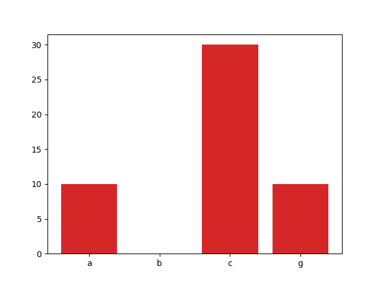
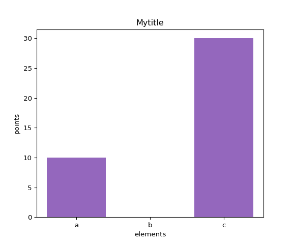
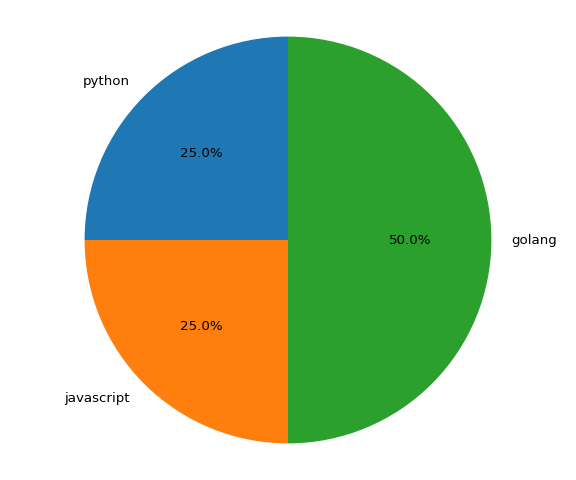

# chartserver
> A server that serves charts over HTTP/HTTPS using Python & Flask.

## Usage
### Bar chart
> To retrieve a bar chart:

    GET /chart/bar/<xpoints>/<ypoints>

> Example:

    GET /chart/bar/a,b,c,g/10,0,30,10

> Will give you this image:

> You can also choose a size on the image by adding these arguments to the
> request:

    GET ...?w=<width>&h=<height>

> You can also choose the color on your bars by adding these arguments:

    GET ...?c=blue,green,black,yellow

> You can also put labels on your chart, like this:

    GET ...?title=Mytitle&ylabel=points&xlabel=elements

> Will look like this:

### Pie chart
> To retrieve a pie chart:

    GET /chart/pie/<labels>/<sizes>

> Example:

    GET /chart/pie/python,javascript,golang/10,10,20

> Will give you this image:

> You can also change `width`, `height`, `color`, `shadow`:

    GET ...?w=<width>&h=<height>&color=red,green,blue&shadow=1

## Cache
> Everything is cached, to disable cache; add this argument:

    GET ...?no_cache=1

## Installing & Running
### Development mode
> First run the setup:

    python setup.py develop

> Then start the program:

    python __main__.py

> The server is now up and running at: `http://localhost:5000`

### Production mode
> coming soon

## Unit tests
> To run the unit tests, first install pytest:

    pip install pytest

> Then run:

    py.test
